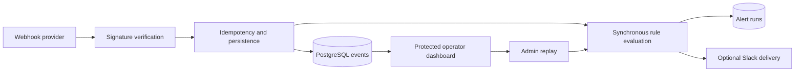

<div align="center">

# Webhook Dashboard & Alerts

### Make incoming system events verifiable, searchable, and actionable.

**A Next.js operations dashboard that verifies signed webhooks, deduplicates events, evaluates alert rules, records outcomes, and supports controlled replay.**

[Architecture](docs/ARCHITECTURE.md) · [Run locally](#running-locally) · [Work with RelayWorks](https://getrelayworks.com/contact/)

  

</div>

## Business problem

Webhooks often become invisible glue: a provider sends an event, an integration performs work, and operators have little evidence when delivery, verification, or downstream actions fail. This application provides a durable event history and an operator surface for investigating what arrived, what matched, and what happened next.

## Key features

- Raw-body HMAC verification for `generic` and timestamped `stripe_like` sources
- Idempotent event persistence using external IDs or payload hashes
- Protected, filterable event list and structured payload detail
- Exact, prefix, and contains alert rules with cooldown tracking
- Database-only and optional Slack webhook alert actions
- Recorded alert-run outcomes even when Slack delivery fails
- Admin-only rule management and event replay through the same evaluation path
- Structured webhook/alert logging and configurable request limiting
- Prisma migrations, seed data, automated tests, and an end-to-end smoke script

## Screenshots

No screenshots are committed because a trustworthy capture requires seeded synthetic events and a redacted Clerk session. The required event-list, event-detail, alert-rule, and replay views are specified in [`docs/SCREENSHOTS.md`](docs/SCREENSHOTS.md).

## Architecture



The current design is intentionally simple: ingestion and rule evaluation share one request path, while persistence ensures the event and rule outcomes remain inspectable. See [`docs/ARCHITECTURE.md`](docs/ARCHITECTURE.md).

## Tech stack

- Next.js 16 App Router, React 19, TypeScript, Tailwind CSS 4
- Prisma and PostgreSQL
- Clerk authentication and admin bootstrap
- Zod validation
- Vitest and Supertest

## Installation

Prerequisites: Node.js 20, npm, PostgreSQL 15+, and a Clerk development application.

```bash
git clone https://github.com/DevCalebR/webhook-dashboard-alerts.git
cd webhook-dashboard-alerts
npm ci
node scripts/setup-env.mjs
```

## Configuration

Edit `.env.local` after running the setup script. Required settings are `DATABASE_URL`, Clerk keys, long random secrets for both webhook sources, and `ADMIN_EMAIL`. Slack delivery is optional. Keep `WEBHOOK_ALLOW_UNSIGNED_GENERIC=false` and `DEV_BYPASS_AUTH=false` outside explicit local testing.

See [`.env.example`](.env.example) for the complete contract. Never reuse the example values in a deployed environment.

## Running locally

```bash
docker compose up -d
npm run db:migrate
npm run db:seed
npm run dev
```

Open `http://localhost:3000`, sign in with the configured admin email, and send a signed synthetic event. Reproducible signing examples are in [`docs/TROUBLESHOOTING.md`](docs/TROUBLESHOOTING.md).

## Validation

```bash
npm run lint
npm run typecheck
npm test
npm run build
npm run smoke
```

The smoke test requires a configured database and local application environment; it verifies ingestion, dashboard visibility, and alert execution.

## Deployment

Deploy to a Node-compatible host with managed PostgreSQL, inject all secrets through the platform, and run `npx prisma migrate deploy`. Configure Clerk for the canonical HTTPS origin. Place an edge or shared rate limiter in front of public webhook routes before scaling beyond a single instance.

## Project structure

```text
src/app/              Dashboard pages, auth, and API routes
src/components/       Shared dashboard interface
src/lib/              Signatures, persistence, alerting, auth, and logging
prisma/               Schema, migrations, and seed
scripts/              Environment setup and end-to-end smoke validation
tests/                Signature, ingestion, replay, and Slack behavior
docs/                 Architecture, screenshots, and troubleshooting
```

## Design decisions

- Signatures are checked against the raw body before JSON parsing.
- Duplicate deliveries return success without inserting or firing alerts twice.
- Replay uses the same rule evaluator as ingestion to reduce behavioral drift.
- Alert delivery failure is recorded without making the provider retry accepted ingestion.
- Operator actions are server-authorized; hiding a button is not the security boundary.

## Known limitations

- Rate limiting is process memory and is not shared across instances.
- Alert evaluation and Slack delivery run synchronously in the ingestion request.
- Only two demonstration signature formats and one external alert channel are implemented.
- `npm audit` currently reports one high, one moderate, and one low dependency advisory; review framework and transitive upgrades before production use rather than applying forced breaking updates.
- The repository does not claim production scale, guaranteed delivery, or parity with provider-specific webhook products.

## Roadmap

- Capture a synthetic operator walkthrough after a clean seeded deployment
- Move alert work to a durable queue when volume or latency requires it
- Replace process-local request limiting before multi-instance deployment
- Add provider adapters only when a real integration requires them

## License

Copyright © 2026 Caleb Rogers. All rights reserved. See [`LICENSE`](LICENSE).

## Work with me

This project demonstrates webhook security, idempotent APIs, operations dashboards, alert workflows, and controlled retries. To discuss an integration or internal operations tool, [contact RelayWorks](https://getrelayworks.com/contact/) or review [DevCalebR on GitHub](https://github.com/DevCalebR).
