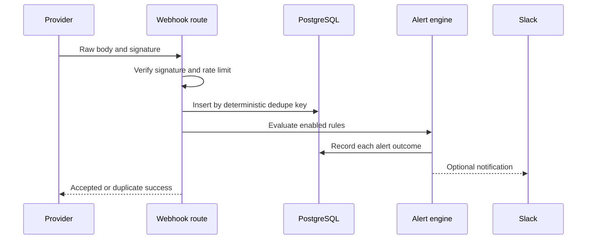

# Architecture

## Event lifecycle

## Boundaries

- `src/app/api/webhooks/` authenticates external input and preserves raw-body semantics.
- `src/lib/` owns signature validation, dedupe, rule matching, cooldowns, delivery, and structured logging.
- Prisma persists events, rules, and alert runs.
- Clerk establishes identity; server-side role checks protect management and replay.

## Failure behavior

Invalid signatures are rejected before persistence. Duplicate deliveries return success without repeating side effects. A Slack failure is recorded on the alert run but does not convert an accepted webhook into a provider retry storm. Process-local rate limits and synchronous delivery are explicit single-instance/MVP constraints.
